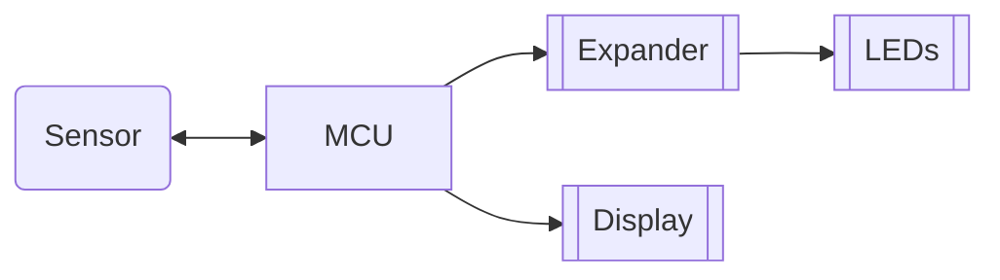

Electronic Compass
==================

Functional Diagram
------------------

Components
----------

| Function          | Component           | Digi Key                                                                                                                   | Datasheet                                                                                                                                                                                  |
| ----------------- | ------------------- | -------------------------------------------------------------------------------------------------------------------------- | ------------------------------------------------------------------------------------------------------------------------------------------------------------------------------------------ |
| Voltage Regulator | LD1117AS33TR        | [497-1228-1-ND](https://www.digikey.com/en/products/detail/stmicroelectronics/LD1117AS33TR/585752)                         | [LD1117A](https://www.st.com/content/ccc/resource/technical/document/datasheet/a5/c3/3f/c9/2b/15/40/49/CD00002116.pdf/files/CD00002116.pdf/jcr:content/translations/en.CD00002116.pdf)     |
| MCU               | STM32C031K6T6       | [497-STM32C031K6T6-ND](https://www.digikey.com/en/products/detail/stmicroelectronics/STM32C031K6T6/17073488)               | [STM32C031x4/x6](https://www.st.com/resource/en/datasheet/stm32c031c4.pdf)                                                                                                                 |
| Sensor            | IIS2MDCTR           | [497-17728-2-ND](https://www.digikey.com/en/products/detail/stmicroelectronics/IIS2MDCTR/7927708)                          | [IIS2MDC](https://www.st.com/content/ccc/resource/technical/document/datasheet/group3/06/f2/a3/a7/74/fe/4b/16/DM00431721/files/DM00431721.pdf/jcr:content/translations/en.DM00431721.pdf)  |
| Display           | ?                   |                                                                                                                            |                                                                                                                                                                                            |

MCU Pin Connection
------------------

| Function        | GPIO | STM32 Module Pin | Device    | Device Signal | Device Pin | Notes                           |
| --------------- | ---- | ---------------- | --------- | ------------- | ---------- | ------------------------------- |
| RESTART         | PF2  |  6               | Prog      | SW            |            | Restart the MCU by push button  |
| SWDIO           | PA13 | 24               | Prog      | DIO           |            | SWD Programming and Debugging   |
| SWCLK           | PA14 | 25               | Prog      | CLK           |            |                                 |
| I2C SCL         | PB6  | 30               | IIS2MDCTR | SCL           | 1          |                                 |
| I2C SDA         | PB7  | 31               | IIS2MDCTR | SDA           | 4          |                                 |
| INT/DRDY        | PA0  |  7               | IIS2MDCTR | INT/DRDY      | 7          | Optional data ready interrupt   |
| I2C SCL         | PB6  | 30               | Display   | SCL           |            | Optional display on the I2C bus |
| I2C SDA         | PB7  | 31               | Display   | SDA           |            |                                 |
| Calibrate       | PA1  | 8                | Button    |               |            | Calibrate by push button        |
| LED  1          | PA2  | 9                | LED       |               |            |                                 |
| LED  2          | PA3  | 10               | LED       |               |            |                                 |
| LED  3          | PA4  | 11               | LED       |               |            |                                 |
| LED  4          | PA5  | 12               | LED       |               |            |                                 |
| LED  5          | PA6  | 13               | LED       |               |            |                                 |
| LED  6          | PA7  | 14               | LED       |               |            |                                 |
| LED  7          | PA8  | 18               | LED       |               |            |                                 |
| LED  8          | PA9  | 19               | LED       |               |            |                                 |
| LED  9          | PA10 | 21               | LED       |               |            |                                 |
| LED 10          | PA11 | 22               | LED       |               |            |                                 |
| LED 11          | PA12 | 23               | LED       |               |            |                                 |
| LED 12          | PA15 | 26               | LED       |               |            |                                 |
| LED 13          | PB0  | 15               | LED       |               |            |                                 |
| LED 14          | PB1  | 16               | LED       |               |            |                                 |
| LED 15          | PB2  | 17               | LED       |               |            |                                 |
| LED 16          | PB3  | 27               | LED       |               |            |                                 |

References
----------
* 