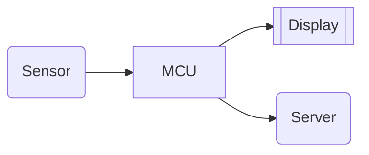

ESP32 humidity and temperature monitor
======================================

Functional Diagram
------------------

Components
----------

| Function          | Component           | Digi Key                                                                                                                   | Datasheet                                                                                                                                                                              |
| ----------------- | ------------------- | -------------------------------------------------------------------------------------------------------------------------- | -------------------------------------------------------------------------------------------------------------------------------------------------------------------------------------- |
| Voltage Regulator | LD1117AS33TR        | [497-1228-1-ND](https://www.digikey.com/en/products/detail/stmicroelectronics/LD1117AS33TR/585752)                         | [LD1117A](https://www.st.com/content/ccc/resource/technical/document/datasheet/a5/c3/3f/c9/2b/15/40/49/CD00002116.pdf/files/CD00002116.pdf/jcr:content/translations/en.CD00002116.pdf) |
| Sensor            | BME280              | [828-1063-1-ND](https://www.digikey.com/en/products/detail/bosch-sensortec/BME280/6136306)                                 | [BME280](https://www.bosch-sensortec.com/media/boschsensortec/downloads/datasheets/bst-bme280-ds002.pdf)                                                                               |
| MCU               | ESP32-WROOM-32UE-N4 | [1965-ESP32-WROOM-32UE-N4CT-ND](https://www.digikey.com/en/products/detail/espressif-systems/ESP32-WROOM-32UE-N4/11613176) | [EXP32-WROOM-32](https://www.espressif.com/sites/default/files/documentation/esp32-wroom-32e_esp32-wroom-32ue_datasheet_en.pdf)                                                        |
| Dispaly           | EA DOGM132S-5       | [1481-1072-ND](https://www.digikey.com/en/products/detail/display-visions/EA-DOGM132S-5/4896711)                           | [DOGM132 GRAPHIC](https://www.lcd-module.de/eng/pdf/grafik/dogm132-5e.pdf)                                                                                                             |
| Antenna           |                     |                                                                                                                            |                                                                                                                                                                                        |

MCU Pin Connection
------------------

* [ESP32-WROOM-32 Pinout Reference](https://lastminuteengineers.com/esp32-wroom-32-pinout-reference)

| Function  | GPIO | Pin | Device | Pin |
| --------- | ---- | --- | ------ | --- |
| VSPI CLK  | 18   | 30  | SCK    | 4   |
| VSPI MISO | 19   | 31  | SDO    | 5   |
| VSPI MOSI | 23   | 37  | SDI    | 3   |
| VSPP CS   | 5    | 29  | SCB    | 2   |
| HSPI CLK  | 14   | 13  | SCL    | 37  |
| HSPI MISO | 12   | 14  | SI     | 36  |
| HSPI MOSI | 13   | 16  |        |     |
| HSPI CS   | 15   | 23  | CS1B   | 40  |
|           | 21   | 33  | A0     | 38  |
|           | 22   | 36  | RST    | 39  |