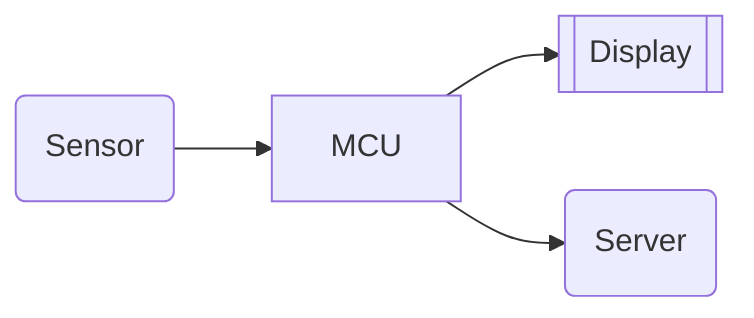
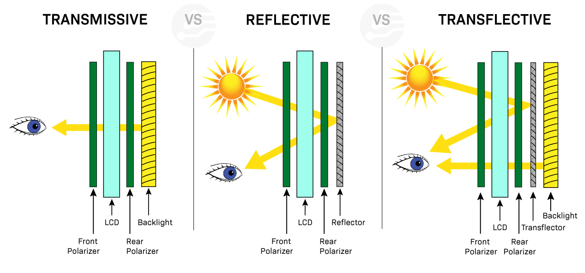

ESP32 humidity and temperature monitor
======================================

Functional Diagram
------------------

Components
----------

| Function          | Component           | Digi Key                                                                                                                   | Datasheet                                                                                                                                                                              |
| ----------------- | ------------------- | -------------------------------------------------------------------------------------------------------------------------- | -------------------------------------------------------------------------------------------------------------------------------------------------------------------------------------- |
| Voltage Regulator | LD1117AS33TR        | [497-1228-1-ND](https://www.digikey.com/en/products/detail/stmicroelectronics/LD1117AS33TR/585752)                         | [LD1117A](https://www.st.com/content/ccc/resource/technical/document/datasheet/a5/c3/3f/c9/2b/15/40/49/CD00002116.pdf/files/CD00002116.pdf/jcr:content/translations/en.CD00002116.pdf) |
| Sensor            | BME280              | [828-1063-1-ND](https://www.digikey.com/en/products/detail/bosch-sensortec/BME280/6136306)                                 | [BME280](https://www.bosch-sensortec.com/media/boschsensortec/downloads/datasheets/bst-bme280-ds002.pdf)                                                                               |
| MCU               | ESP32-WROOM-32UE-N4 | [1965-ESP32-WROOM-32UE-N4CT-ND](https://www.digikey.com/en/products/detail/espressif-systems/ESP32-WROOM-32UE-N4/11613176) | [EXP32-WROOM-32](https://www.espressif.com/sites/default/files/documentation/esp32-wroom-32e_esp32-wroom-32ue_datasheet_en.pdf)                                                        |
| Display           | EA DOGM132S-5       | [1481-1072-ND](https://www.digikey.com/en/products/detail/display-visions/EA-DOGM132S-5/4896711)                           | [DOGM132 GRAPHIC](https://www.lcd-module.de/eng/pdf/grafik/dogm132-5e.pdf)                                                                                                             |
| Antenna           |                     |                                                                                                                            |                                                                                                                                                                                        |

### Display Options

#### LCD and OLED

| Component           | Manufacturer    | Price  | Type | Display Mode  | Viewing Area / Size   | Outline L x W x H          | Dot Pixels      | Interface | Digi Key                                                                                                          | Datasheet                                                                                                                    |
| ------------------- | --------------- | ------ | ---- | ------------- | --------------------- | -------------------------- | --------------- | --------- | ----------------------------------------------------------------------------------------------------------------- | ---------------------------------------------------------------------------------------------------------------------------- |
| EA DOGM132S-5       | Display Visions |        | FSTN | Transmissive  | 51.00mm W x 15.00mm H |                            | 132 x 32        | SPI       | [1481-1072-ND](https://www.digikey.com/en/products/detail/display-visions/EA-DOGM132S-5/4896711)                  | [DOGM132 GRAPHIC](https://www.lcd-module.de/eng/pdf/grafik/dogm132-5e.pdf)                                                   |
| EA LED55X31-W       | Display Visions |        | LED  | Backlight     | 51mm x 14.5mm x 2mm   |                            |                 |           | [1481-1158-ND](https://www.digikey.com/en/products/detail/display-visions/EA-LED55X31-W/4896797)                  | [DOG SERIES 3.3V](https://www.lcd-module.de/eng/pdf/doma/dog-me.pdf)                                                         |
| 64128K FC BW-3      | Displaytech     | $23.94 | FSTN | Transflective | 50.00mm W x 25.00mm H |                            | 128 x 64        |           | [1756-1037-ND](https://www.digikey.com/en/products/detail/displaytech/64128K-FC-BW-3/6650331)                     | [64128K Series LCD Module](https://www.seacomp.com/sites/default/files/datasheets/64128K-Series-Rev1_2-Displaytech-Spec.pdf) |
| EA DOGM128L-6       | Display Visions |        | STN  | Reflective    | 51.00mm W x 31.00mm H |                            | 128 x 64        | SPI       | [1481-1066-ND](https://www.digikey.com/en/products/detail/display-visions/EA-DOGM128L-6/4896705)                  | [DOGM128-6](https://www.lcd-module.de/eng/pdf/grafik/dogm128e.pdf)                                                           |
| EA LED55X46-W       | Display Visions |        | LED  | Backlight     | 51mm x 31mm x 2mm     |                            |                 |           | [1481-1165-ND](https://www.digikey.com/en/products/detail/display-visions/ea-led55x46-w/4896804)                  | [DOGM128-6](https://www.lcd-module.de/eng/pdf/grafik/dogm128e.pdf)                                                           |
| EA DOGS102N-6       | Display Visions | $20.55 | FSTN | Reflective    | 36.00mm W x 25.00mm H |                            | 102 x 64        | SPI       | [1481-1093-ND](https://www.digikey.com/en/products/detail/display-visions/EA-DOGS102N-6/4896732)                  | [DOGS102-6](https://www.lcd-module.de/eng/pdf/grafik/dogs102-6e.pdf)                                                         |
| EA DOGS164N-A       | Display Visions | $15.72 | FSTN | Reflective    | 38.00mm L x 19.00mm W | 40.00mm x 33.00mm x 2.60mm |                 | SPI       | [1481-1305-ND](https://www.digikey.com/en/products/detail/display-visions/EA-DOGS164N-A/9972236)                  | [DOGS164-A](https://www.lcd-module.de/fileadmin/html-seiten/eng/pdf/doma/dogs164e.pdf)                                       |
| G126ADGFGN02WRC0XAL | Focus LCDs      | $11.47 | FSTN | Reflective    | 50.00mm W x 25.00mm H |                            | 128 x 64        | SPI       | [2632-G126ADGFGN02WRC0XAL-ND](https://www.digikey.com/en/products/detail/focus-lcds/G126ADGFGN02WRC0XAL/12691086) | [G126ADGFGN02WRC0XAL](https://focuslcds.com/wp-content/uploads/Specs/G126ADGFGN02WRC0XAL_Spec.pdf)                           |

MCU Pin Connection
------------------

* [ESP32-WROOM-32 Pinout Reference](https://lastminuteengineers.com/esp32-wroom-32-pinout-reference)

| Function  | GPIO | ANE32 Pin | Pin | Device  | Device Pin | Pin |
| --------- | ---- | --------- | --- | ------- | ---------- | --- |
| BOOT      |  0   |           | 25  | Prog    | SW         |     |
| TX        |  1   |           | 35  | Prog    | TX         |     |
| RX        |  3   |           | 34  | Prog    | RX         |     |
| MOSI      | 38   | D11       |     | BME 280 | SCK        | 4   |
| MISO      | 47   | D12       |     | BME 280 | SDO        | 5   |
| SCKL      | 48   | D13       |     | BME 280 | SDI        | 3   |
| CS        | 21   | D10       |     | BME 280 | SCB        | 2   |
| MOSI      |  8   | D5        |     | DOGS102 | SDA/SI     | 24  |
| SCKL      |  9   | D6        |     | DOGS102 | SCK/SCL    | 25  |
| CS        | 10   | D7        |     | DOGS102 | CS0/CS     | 28  |
|           | 17   | D8        |     | DOGS102 | CD/A0      | 26  |
|           | 18   | D9        |     | DOGS102 | RST        | 27  |
