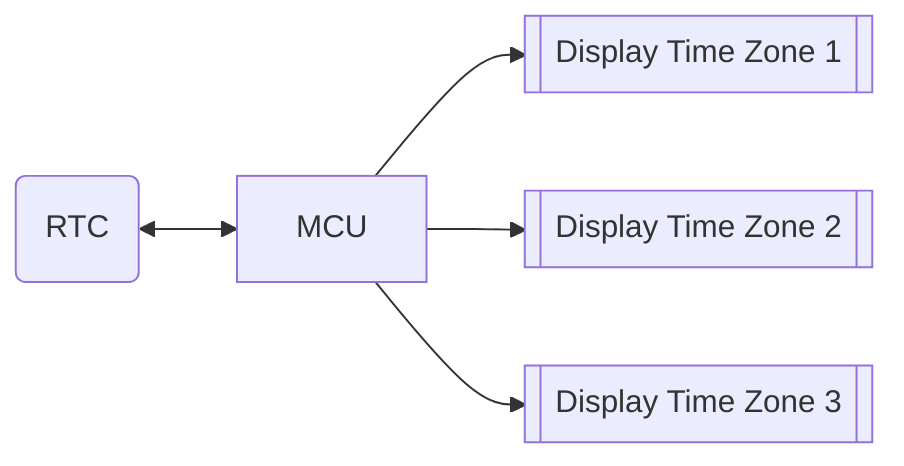

ESP32 Three Time Zone World Clock
=================================

Functional Diagram
------------------

Components
----------

| Function          | Component           | Digi Key                                                                                                                   | Datasheet                                                                                                                                                                              |
| ----------------- | ------------------- | -------------------------------------------------------------------------------------------------------------------------- | -------------------------------------------------------------------------------------------------------------------------------------------------------------------------------------- |
| Voltage Regulator | LD1117AS33TR        | [497-1228-1-ND](https://www.digikey.com/en/products/detail/stmicroelectronics/LD1117AS33TR/585752)                         | [LD1117A](https://www.st.com/content/ccc/resource/technical/document/datasheet/a5/c3/3f/c9/2b/15/40/49/CD00002116.pdf/files/CD00002116.pdf/jcr:content/translations/en.CD00002116.pdf) |
| MCU               | ESP32-WROOM-32UE-N4 | [1965-ESP32-WROOM-32UE-N4CT-ND](https://www.digikey.com/en/products/detail/espressif-systems/ESP32-WROOM-32UE-N4/11613176) | [EXP32-WROOM-32](https://www.espressif.com/sites/default/files/documentation/esp32-wroom-32e_esp32-wroom-32ue_datasheet_en.pdf)                                                        |
| Display           | TM1637              |                                                                                                                            |                                                                                                                                                                                        |
| RTC               | DS3232              | [DS3232MZ+TRL](https://www.digikey.com/en/products/detail/analog-devices-inc-maxim-integrated/DS3232MZ-TRL/3087654)        | [DS3232](https://www.analog.com/media/en/technical-documentation/data-sheets/ds3232m.pdf)                                                                                              |
| Speaker           | AS04008MR-21-R      | [668-AS04008MR-21-R-ND](https://www.digikey.com/en/products/detail/pui-audio-inc/AS04008MR-21-R/13165930)                  | [AS04008MR-21-R](https://puiaudio.com/file/specs-AS04008MR-21-R.pdf)                                                                                                                   |
| Rotary Encoder    | EC11E15244G1        | [4809-EC11E15244G1-ND](https://www.digikey.com/en/products/detail/alps-alpine/EC11E15244G1/21721550)                       | [EC11E15244G1](https://tech.alpsalpine.com/e/products/detail/EC11E15244G1/)                                                                                                            |
| Indicator Lamp    | WP3VEGW             | [754-1221-ND](https://www.digikey.com/en/products/detail/kingbright/WP3VEGW/1747620)                                       | [WP3VEGW](https://www.kingbrightusa.com/images/catalog/SPEC/WP3VEGW.pdf)                                                                                                               |
| Antenna           |                     |                                                                                                                            |                                                                                                                                                                                        |

MCU Pin Connection
------------------

* [ESP32-WROOM-32 Pinout Reference](https://lastminuteengineers.com/esp32-wroom-32-pinout-reference)

| Function        | GPIO | ESP32 Module Pin | Device    | Device Signal | Device Pin |
| --------------- | ---- | ---------------- | --------- | ------------- | ---------- |
| BOOT            | 0    | 25               | Prog      | SW            |            |
| UART0 TX        | 1    | 35               | Prog      | TX            |            |
| UART0 RX        | 3    | 34               | Prog      | RX            |            |
| I2C SDA         | 21   | 33               | DS3232    | SDA           | 7          |
| I2C SCL         | 22   | 36               | DS3232    | SCL           | 8          |
| RTC INT         | 27   | 12               | DS3232    | INT/SQW       | 13         |
| TZ1 CLK         | 13   | 16               | TM1637 #1 | CLK           |            |
| TZ1 DIO         | 14   | 13               | TM1637 #1 | DIO           |            |
| TZ2 CLK         | 16   | 27               | TM1637 #2 | CLK           |            |
| TZ2 DIO         | 17   | 28               | TM1637 #2 | DIO           |            |
| TZ3 CLK         | 18   | 30               | TM1637 #3 | CLK           |            |
| TZ3 DIO         | 19   | 31               | TM1637 #3 | DIO           |            |
| Rotary CLK      | 23   | 37               | Rotary    | CLK           |            |
| Rotary DT       | 32   | 8                | Rotary    | DT            |            |
| Rotary SW       | 33   | 9                | Rotary    | SW            |            |
| DAC Audio       | 25   | 10               | Audio     | OUT           |            |
| Status LED      | 26   | 11               | LED       |               |            |
| Error LED       | 4    | 26               | LED       |               |            |

References
----------
* [I2C pins on the ESP32](https://rntlab.com/question/what-pins-are-the-i2c-pins-on-the-esp32/)